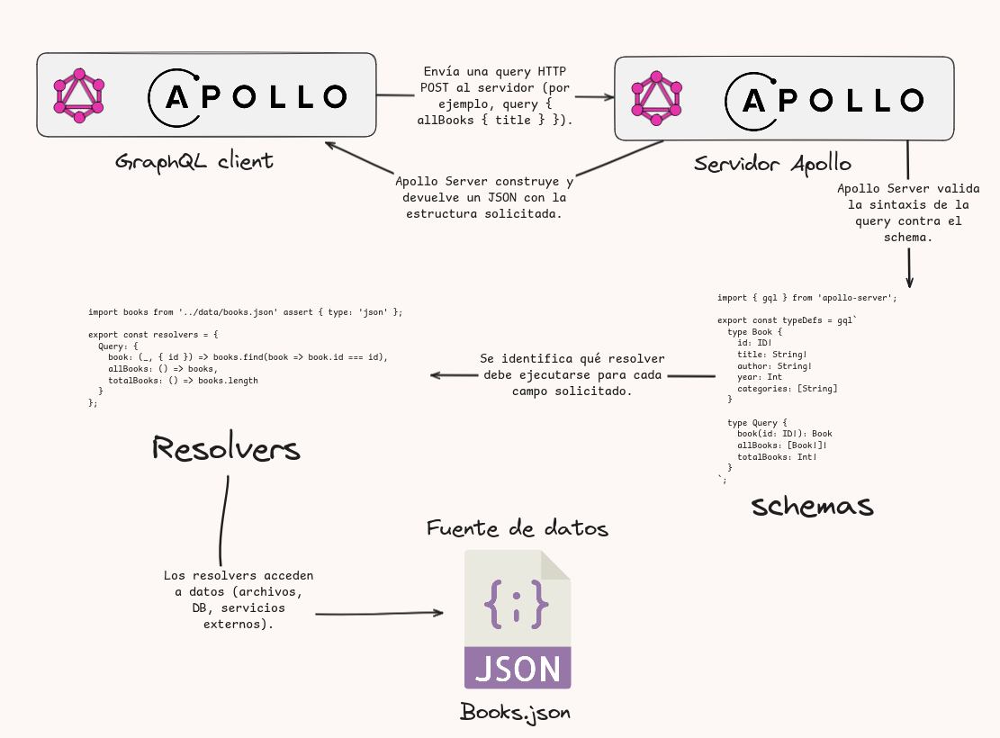

# GraphQL API - Books

API desarrollada con Node.js, Apollo Server 4 y GraphQL, que expone operaciones de lectura (`queries`) sobre una colección de libros cargados desde un archivo JSON estático. El objetivo de este proyecto es servir como base mínima y moderna para aprender y construir servicios GraphQL con una arquitectura limpia y modular.



---

## Tecnologías utilizadas

- **Node.js** (v18 o superior): motor de ejecución de JavaScript.
- **ES Modules (ESM)**: sintaxis moderna de `import/export` sin necesidad de transpiladores.
- **Apollo Server 4**: servidor GraphQL minimalista y eficiente.
- **GraphQL**: lenguaje de consulta para APIs fuertemente tipadas.

---

## Estructura del proyecto

```

graphql-api/
│
├── data/
│   └── books.json          # Fuente de datos local en formato JSON
│
├── src/
│   ├── index.js            # Punto de entrada del servidor
│   ├── schema.js           # Definición de tipos (typeDefs) GraphQL
│   └── resolvers.js        # Implementación de funciones resolutoras
│
└── package.json            # Configuración del proyecto y dependencias

````

---

## Instalación y ejecución

### Requisitos previos

- Node.js v18 o superior
- npm (gestor de paquetes)

### Instalación

Clona el repositorio o crea la estructura manualmente, luego ejecuta:

```bash
npm install
````

### Ejecución

```bash
npm run start
```

El servidor quedará disponible en:

```
http://localhost:4000/
```

Allí se expone una interfaz gráfica de Apollo Studio donde puedes ejecutar consultas (GraphiQL embebido).

---

## Esquema GraphQL

### Tipos (`typeDefs`)

```graphql
type Book {
  id: ID!
  title: String!
  author: String!
  year: Int
  categories: [String]
}

type Query {
  book(id: ID!): Book
  allBooks: [Book!]!
  totalBooks: Int!
}
```

---

## Consultas disponibles (`Query`)

### Obtener un libro por ID

```graphql
query {
  book(id: "1") {
    title
    author
    categories
  }
}
```

### Listar todos los libros

```graphql
query {
  allBooks {
    id
    title
    author
  }
}
```

### Contar total de libros

```graphql
query {
  totalBooks
}
```

---

## Consideraciones técnicas

* El archivo `books.json` simula una fuente de datos persistente, útil para entornos de desarrollo o prototipado.
* Se utiliza `assert { type: 'json' }` en las importaciones para garantizar compatibilidad con ESM en Node.js.
* `typeDefs` y `resolvers` están desacoplados para fomentar modularidad y mantenibilidad.
* No se requiere ningún framework HTTP adicional como Express, lo que reduce la superficie de ataque y mejora el rendimiento.

---

## Próximas mejoras sugeridas

* Implementación de mutaciones (`Mutation`) para crear, editar o eliminar libros.
* Validación de entradas con GraphQL scalars o middleware personalizado.
* Persistencia real con una base de datos como MongoDB o PostgreSQL.
* Separación por módulos (por ejemplo: `modules/books/schema.js`, `modules/books/resolvers.js`).
* Soporte para filtrado, ordenamiento y paginación en `allBooks`.

